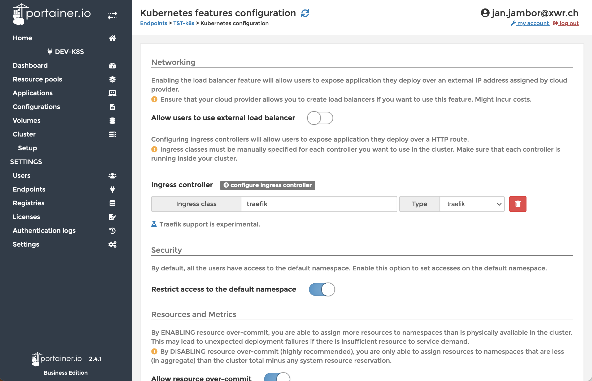
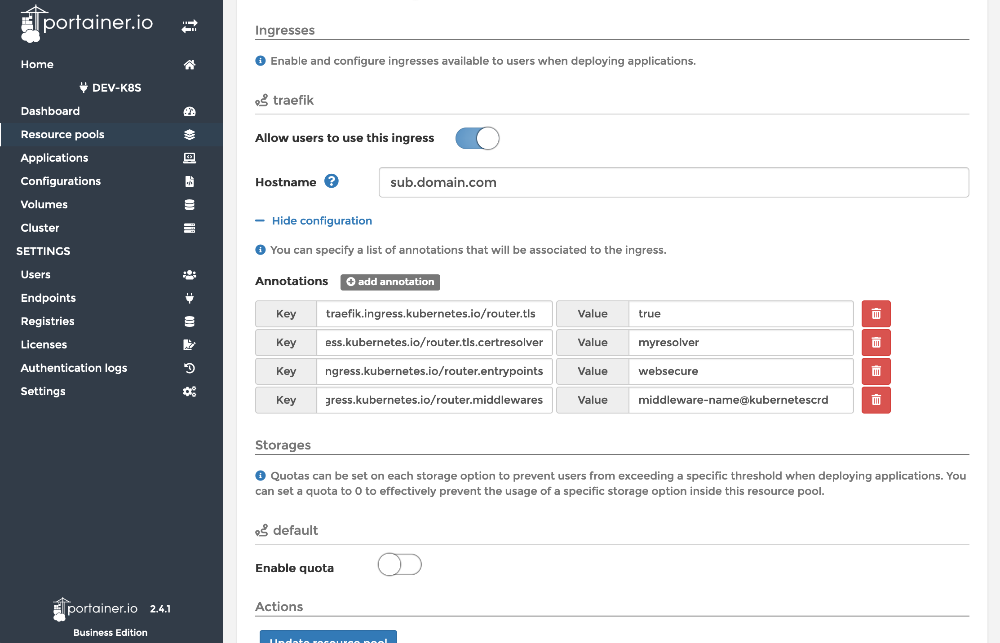
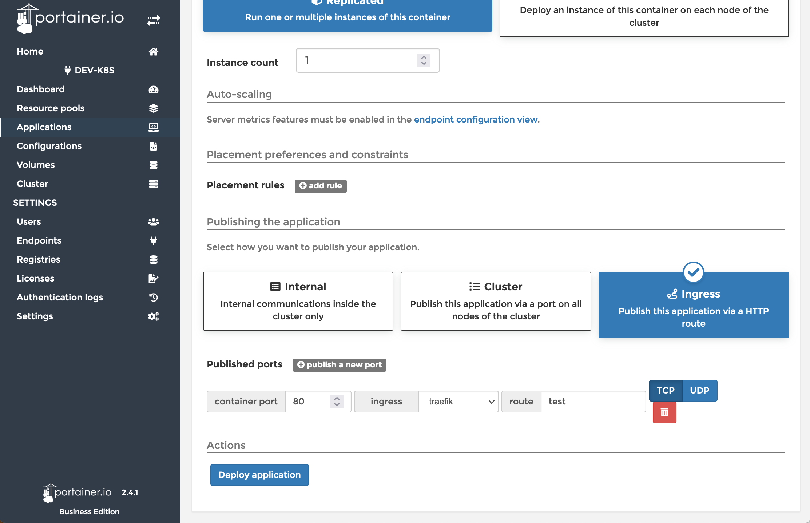

# AKS with Terraform and Portainer

I need to frequently test things in an Azure Kubernetes Services (AKS) cluster. For this I've set up a Terraform pipeline that creates different environments:

- DEV: a very short-lived environment that is created with limited resources. This instance will be destroyed every night automatically for cost-saving reasons.
- TST: a near-production system that is also treated as such. For cost-saving aspects resources for this environment were reserved at Azure for a long timeframe.
- PRD: right now this instance is not used. Production grade apps are deployed currently as Azure Container Instance ACI


Setting up a Kubernetes cluster and managing it with Portainer can be fun. (Photo by [Kaique Rocha from Pexels](https://www.pexels.com/photo/man-jumping-on-intermodal-container-379964/))

## Prerequisites for Terraform

- A service principal
- A storage account for terraform state file.

### Service principal

If you need to create a new one:

```bash
az ad sp create-for-rbac --role="Contributor" --scopes="/subscriptions/$SUB_ID"
```

Update the variables `subscription_id`, `tenant_id`, `client_id` and `client_secret` in your local azure.conf

Debugging if you have one already and it's not working. One reason can be to have expired credentials.

```bash
az ad sp list --show-mine
az role assignment list --assignee $APP_ID
az ad sp credential reset --name $APP_ID
az login --service-principal --username $APP_ID --password $PASSWORD --tenant $TENANT_ID
az login
az account set --subscription $SUB_ID
```

### Storage account

```bash
$ az storage account create \
  --name $STORAGE_ACCOUNT \
  --resource-group $RESOURCE_GROUP \
  --kind StorageV2 \
  --sku Standard_LRS \
  --https-only true \
  --allow-blob-public-access false
```

If you have already a storage account, you can check it with:

```bash
az account list --output table
az account set --subscription $SUB_ID
az storage account list -g $RESOURCE_GROUP
az storage account show -g $RESOURCE_GROUP -n $STORAGE_ACCOUNT
```

If you need to create a container:

```bash
az storage container create -n tfstate-devopserver --account-name stdefaultkstjj001 --account-key <YourAzureStorageAccountKey>
```

## How to work with this repo

### Automated process with pipelines

All required credentials are stored in a variable library called `k8s-setup` and are used by the pipeline. There is no need to set anything up locally. The required variables in the library are:

- `storage_account_name`= the name of the storage account, where the terraform state file is located
- `resource_group_name`= the name of the resource group the storage account is in
- `container_name`= "tfstate-k8s"
- `key`= "terraform.tfstate"
- `subscription_id`= your subscription id
- `tenant_id`= your tenant id
- `client_id`= your app id
- `client_secret`= your app password

1. Run the pipeline `k8s-infrastructure-pipeline.yaml` and wait for it to be completed. This might take around 10 minutes.

2. After that retrieve the public IP of your traefik instance and update your DNS:

    ```bash
    az login
    az aks get-credentials --resource-group DEV-rg-k8s-kstjj-001 --name k8s --overwrite-existing
    az aks get-credentials --resource-group TST-rg-k8s-kstjj-001 --name k8s --overwrite-existing
    kubectl get service traefik -n ns-admin
    ```

    **Important Note**: don't publish any external-facing web UIs until the DNS propagation is successful. Otherwise, Let's Encrypt might block you due to authentication errors.

3. Check also the newly created public IP of your Portainer Agent instance and create or update the endpoint configuration in your Portainer Control Node.

```bash
kubectl get service portainer-agent -n portainer
```

After that, your cluster is fully operational and can be controlled via Portainer. Apps can be deployed including exposure of HTTPS-enabled web UIs.

### Local development & test

If you don't want to make use of pipelines, create an `azure.conf` file with the following content. **Important Note**: your `azure.conf` file must be added to your `.gitignore` file and should never be committed to a repository. It must contain something like this:

```bash
# azure.conf, must be in .gitignore
storage_account_name="$STORAGE_ACCOUNT"
resource_group_name="$RESOURCE_GROUP"
container_name="tfstate-k8s"
key="terraform.tfstate"
subscription_id="$SUB_ID"
tenant_id="$TENANT_ID"
client_id="$APP_ID"
client_secret="$PASSWORD"
```

Then run the different steps of the pipeline manually. Ensure to use the right workspace name which equals the stage you are going to deploy.

```bash
terraform init -backend-config=azure.conf
./workspacetest.sh DEV
terraform plan -out out.plan
terraform apply out.plan
```

### Updateing kubernetes

First of all check which versions Azure supports in your region. You can also review the [AKS Kubernetes Release Calendar](https://docs.microsoft.com/en-us/azure/aks/supported-kubernetes-versions?tabs=azure-cli#aks-kubernetes-release-calendar). Generally, a new Kubernetes version will be available for preview on Azure a month after it has been released.

```bash
az aks get-versions --location westeurope --output table
```

The output will tell you what is possible:

```bash
KubernetesVersion    Upgrades
-------------------  ----------------------------------------
1.22.2(preview)      None available
1.22.1(preview)      1.22.2(preview)
1.21.2               1.22.1(preview), 1.22.2(preview)
1.21.1               1.21.2, 1.22.1(preview), 1.22.2(preview)
1.20.9               1.21.1, 1.21.2
```

When you found the version you are planning to update your cluster to, update the `kubernetes_version` variable in the `variables.tf` file accordingly and deploy a new DEV cluster and test this new version before updating any TST or PRD environment.

## Create Traefik specific resources

Traefik specific resources like middlewares must be created with manifests. You see one example for a IP whitelist in the [k8s-apps-03-traefik-middleware-example.yaml](k8s-apps-03-traefik-middleware-example.yaml) file.

You can apply these manifests as an administrator in Portainer.

After that, you can make use of these Middlewares by adding them as an annotation on the resource group level.

## How to add an application via Portainer

### Preparation

#### Endpoint

Configure the endpoint of your AKS cluster and enable Ingress. Set `Ingress class` to `traefik` (this must be the name of the IngressClass in [k8s-apps-02-traefik.yaml](k8s-apps-02-traefik.yaml)) and select for `Type` the value `traefik`.


#### Namespaces

Configure the namespace and add these annotations:

```yaml
traefik.ingress.kubernetes.io/router.tls: true
traefik.ingress.kubernetes.io/router.tls.certresolver: myresolver
traefik.ingress.kubernetes.io/router.entrypoints: websecure
```

If you want to add middlewares, add a further entry like the following. Ensure to replace `{{namespace}}` and `{{middleware-name}}` by the actual names. Be aware that these middlewares are added to all applications in the resource group.

```yaml
traefik.ingress.kubernetes.io/router.middlewares: {{namespace}}-{{middleware-name}}@kubernetescrd
```



#### App

Create or edit an app and publish a port via an ingress.


